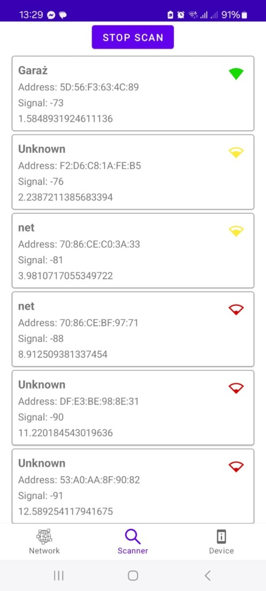

# 📱 BLE Scanner

Aplikacja mobilna na Androida, napisana w Kotlinie, umożliwiająca skanowanie pobliskich urządzeń Bluetooth Low Energy (BLE) oraz tworzenie sieci BLE Mesh dla specjalistycznych urządzeń.

## 🔍 Opis projektu

BLE Scanner to narzędzie służące do wykrywania urządzeń BLE w otoczeniu. Aplikacja wykorzystuje Bluetooth systemu Android do skanowania dostępnych urządzeń, wyświetlania ich nazw, adresów MAC oraz siły sygnału (RSSI).

Dodatkowo wspiera tworzenie sieci BLE Mesh dla konkretnych typów urządzeń, umożliwiając zarządzanie nimi (odczyt i zapis danych). Może być przydatna m.in. do testowania beaconów, urządzeń IoT, opasek fitness czy innych inteligentnych urządzeń BLE.

## 🎯 Funkcje

- ✅ Skanowanie urządzeń BLE
- ✅ Wyświetlanie nazwy, adresu MAC i siły sygnału (RSSI)
- ✅ Obsługa uprawnień lokalizacji i Bluetooth
- ✅ Tworzenie sieci BLE Mesh
- ✅ Zarządzanie urządzeniami w sieci
- ✅ Odczyt danych z urządzeń
- ✅ Zapis danych do urządzeń

## 📸 Zrzuty ekranu

## 🛠️ Technologie

Projekt został napisany w:

- Kotlin
- Android SDK (API 31+)
- Android BLE API
- View Binding
- Android Permissions API

## 🚀 Jak uruchomić projekt lokalnie

1. Otwórz projekt w **Android Studio**.
2. Zbuduj projekt (`Build > Make Project`).
3. Uruchom aplikację na fizycznym urządzeniu (emulatory nie obsługują BLE).
4. Zezwól aplikacji na wymagane uprawnienia: Bluetooth, lokalizacja.

> ℹ️ **Uwaga:** Emulator Androida zazwyczaj nie obsługuje funkcji Bluetooth – zalecane jest użycie fizycznego telefonu.

## 👤 Autor

- **PollemAnt**
- GitHub: [github.com/PollemAnt](https://github.com/PollemAnt)